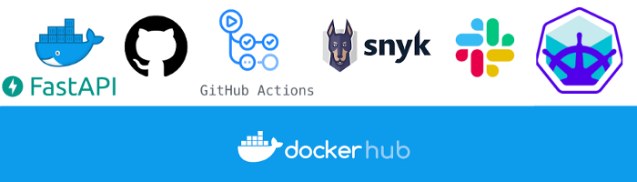
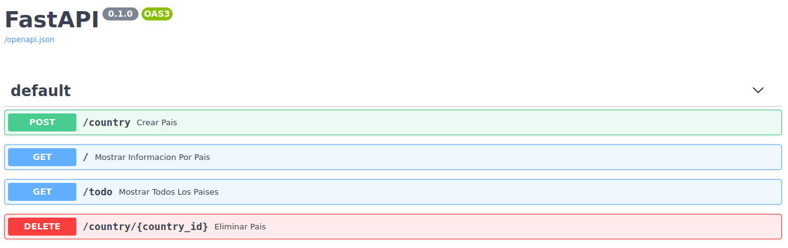

## Lightning talk Fligoo

## Ejecución solo pull:

docker pull testmediumlabjs/github_actions_medium:latest

docker run -d -p 8000:15400 --name fast_api testmediumlabjs/github_actions_medium:latest

localhost:8000/docs

## Flujo de trabajo:-

- Ejemplo FastAPI
- Dockerfile
- .github/workflows/push.yml
- Push
- Verificación de repositorio
- Obtención de metadata
- Preparar variables locales
- Inicio de QEMU para emular procesos basados en traducción dinámica de binarios
- Inicio de BUILDX como complemento CLI de Docker
- Login a Dockerhub
- Crear y subir la imagen
- Sincronizar el README de Github con el de Dockerhub
- Obtener el nombre y el sha de la imagen creada
- Correr Snyk para checkear vulnerabilidades en la imagen creada
- Notifica por Slack la ejecución del Github Action

## Actualización

- Deploy Minikube local (No forma parte del github actions)

## Url

https://hub.docker.com/repository/docker/testmediumlabjs/github_actions_medium

